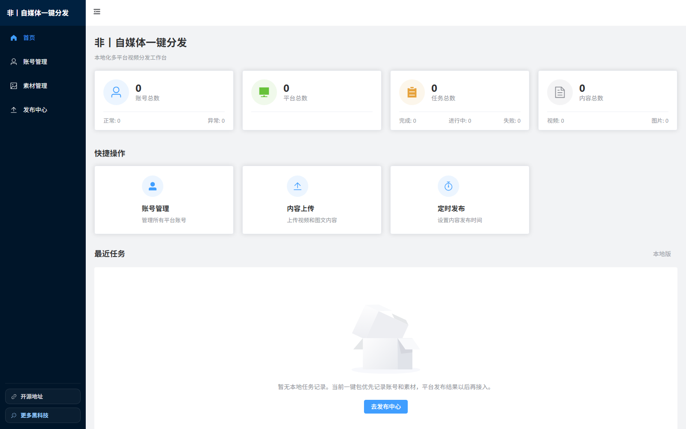

<h1 align="center">非丨自媒体一键分发</h1>

<p align="center">
  <strong>面向内容创作者的本地化多平台视频发布工作台</strong>
</p>

<p align="center">
  <a href="./LICENSE"></a>
  
  
  
  
  
</p>

<p align="center">
  账号管理、素材管理、平台封面、作品文案、话题、立即发布、定时发布、发布前账号检测与调试预发布检查，统一在一个本地 Web 工作台中完成。
</p>

<p align="center">
  
</p>

---

## 项目定位

`非丨自媒体一键分发` 是一个本地优先的创作者发布工具，不是云端代运营系统。它把多个平台重复、分散、容易出错的发布准备动作收敛到一个 Web 管理界面里，让创作者可以更稳定地完成素材上传、封面配置、文案填充、话题处理、定时设置和发布前账号检测。

项目默认保护本地数据：账号登录态、素材、封面、日志和数据库都保存在用户自己的运行环境中，不随源码仓库提交，也不会被整合包构建脚本自动带出。

> 本项目仅供技术研究、学习交流和个人内容管理效率提升使用。请遵守各平台用户协议、社区规范、内容发布规则及所在地法律法规。

## 目录

- [功能概览](#功能概览)
- [支持平台](#支持平台)
- [快速开始](#快速开始)
- [配置说明](#配置说明)
- [整合包分发](#整合包分发)
- [本地数据与隐私](#本地数据与隐私)
- [项目结构](#项目结构)
- [测试与验证](#测试与验证)
- [已知边界](#已知边界)
- [开源来源与致谢](#开源来源与致谢)
- [免责声明](#免责声明)

## 功能概览

| 模块 | 能力 |
| --- | --- |
| 发布中心 | 多平台选择、账号主体、素材队列、平台封面、公共文案、话题、立即/定时发布 |
| 发布前账号检测 | 点击发布时可选择先检测本次账号登录状态；检测失败会提示用户先重登，不会自动跳过异常平台 |
| 批量发布流程 | 按 `抖音 -> 视频号 -> B站 -> 小红书 -> 快手` 的顺序执行多平台发布准备 |
| 定时发布 | 支持开始天数、每天条数、基准时间和随机浮动分钟 |
| 封面适配 | 针对平台差异处理横封面、竖封面、双封面和平台当前比例 |
| 账号管理 | 支持本地登录态保存、账号状态刷新、多平台后台标签页打开 |
| 调试预发布检查 | 开发调试时可只执行上传、填表、封面和定时设置，停在最终发布前 |
| 失败收口 | 单个平台某条视频失败后停止该平台后续视频，避免半完成任务继续推进 |

## 支持平台

| 平台 | 当前适配能力 |
| --- | --- |
| 抖音 | 视频上传、作品简介、话题、横/竖封面、定时发布、发布前账号检测 |
| 视频号 | 视频上传、描述与话题、短标题、个人主页卡片、分享卡片、定时发布、发布前账号检测 |
| B站 | 视频上传、稿件标题、简介、标签、分区、创作声明、双封面、定时发布、发布前账号检测 |
| 小红书 | 视频上传、作品简介、有效话题节点、封面比例选择、定时发布、发布前账号检测 |
| 快手 | 视频上传、作品描述、话题、封面比例选择、定时发布、发布前账号检测 |

仓库中仍保留部分原项目平台目录，实际可用能力以当前发布中心和各上传器适配状态为准。国内平台发布页变化较快，选择器和交互流程需要持续维护。

## 关键增强

### 发布体验

- 重构发布中心信息架构：账号主体、平台选择、素材、封面、作品文案、话题和发布方式分区更清晰。
- 点击发布时弹出账号检测提示，用户可以选择“先检测并发布”或“跳过检测直接发布”。
- 检测失败时提示用户回到账号管理重新登录，不会静默跳过异常平台。
- 发布素材改为稳定列表形态，避免文件数量变化导致组件高度大幅抖动。
- 平台封面区域使用固定展示空间，减少不同尺寸、不同数量封面造成的布局跳变。
- B站单独提供必填“稿件标题”和独立简介，更适合多平台差异化发布。

### 平台适配

- 抖音：横封面 `4:3`、竖封面 `3:4` 分别处理，定时时间写入后做回读校验。
- 视频号：个人主页卡片 `3:4`、分享卡片 `4:3` 分别处理，定时输入后执行失焦确认。
- B站：首页推荐 `4:3`、个人空间 `16:9` 双封面处理，并适配新版创作声明、分区、标签和简介流程。
- 小红书：按当前封面比例上传对应封面；话题必须进入平台有效话题节点状态，失败时会阻止继续发布。
- 快手：处理常见发布引导弹窗，按平台当前选择比例上传对应封面。

### 稳定性

- 多平台发布使用同一个浏览器窗口下的多个标签页，减少浏览器上下文混乱。
- 自动化浏览器窗口最大化显示，减少固定尺寸导致页面边缘被截断的问题。
- 发布前增加可选账号检测，视频号等登录态易过期的平台可以在上传前先拦截。
- 调试模式支持停在最终发布前，不直接点击平台发布按钮。
- 多条视频批量处理时增加失败收口，避免异常后继续推进导致状态不可控。

## 快速开始

### 普通用户：使用整合包

普通用户推荐使用 `release/` 下生成的整合包 zip。整合包内置 Python、依赖和 Playwright Chromium，用户电脑不需要提前安装 Python、Node、npm 或 Playwright。

用户拿到 zip 后：

1. 解压整个文件夹。
2. 双击包内 `start-oneclick.bat`。
3. 浏览器自动打开 `http://127.0.0.1:5409/`。
4. 进入“账号管理”登录平台账号。
5. 回到“发布中心”选择素材、平台、文案、封面和发布方式。

整合包内同时包含：

- `README-zh-CN.txt`：简版中文说明。
- `new-user-guide.html`：给新手用户看的图文教程。

### 开发者：源码启动

环境要求：

- Windows 10/11
- Python 3.12 推荐；已有 `.venv` 时会直接复用
- `uv`，首次运行源码版 `start-oneclick.bat` 且 `.venv` 不存在时需要
- Node.js 18+，仅前端开发或重新构建前端时需要
- Chrome / Edge / Playwright Chromium

启动源码版：

```bat
start-oneclick.bat
```

`start-oneclick.bat` 会检查本地 `.venv`、安装缺失依赖、安装 Playwright Chromium，并打开：

```text
http://127.0.0.1:5409/
```

`run.bat` 是旧的嵌入式 Python 启动入口，只有在本地已经准备好 `python/` 目录时才适用；日常源码开发优先使用 `start-oneclick.bat`。

## 配置说明

公开仓库提供 `conf.example.py` 作为配置参考。首次运行前可以按需复制为 `conf.py` 并修改本地浏览器路径、调试开关等参数。

```python
LOCAL_CHROME_PATH = ""
USE_SYSTEM_BROWSER = False
DEBUG_SKIP_FINAL_PUBLISH = False
```

正式发布默认会点击平台最终发布/定时发布按钮。

如果要做自动化调试，可以临时改成：

```python
DEBUG_SKIP_FINAL_PUBLISH = True
```

这样系统只完成上传、填表、封面和定时设置，不点击各平台最终发布按钮，便于人工检查。

## 整合包分发

在项目根目录运行：

```powershell
powershell -ExecutionPolicy Bypass -File .\scripts\build-oneclick-package.ps1
```

构建完成后会在 `release/` 下生成：

- `auto-upload-oneclick-时间戳/`：可直接运行的文件夹。
- `auto-upload-oneclick-时间戳.zip`：可分发压缩包。

构建脚本会复制源码、前端产物、运行时依赖和新手文档，并主动排除这些敏感或本地运行数据：

- `cookiesFile/`
- `db/`
- `logs/`
- `avatars/`
- `videoFile/`
- `.venv/`
- `.git/`
- `frontend/node_modules/`
- `release/`
- `测试文件/`

分发前仍建议打开生成目录确认 `cookiesFile/`、`videoFile/`、`db/`、`logs/`、`avatars/` 为空。

更多细节见 [一键分发整合包](./docs/一键分发整合包.md)。

## 本地数据与隐私

以下目录属于运行时数据，不应提交到公开仓库，也不建议打包进源码发布物：

| 路径 | 内容 |
| --- | --- |
| `cookiesFile/` | 平台登录态和 Cookie |
| `db/` | 本地数据库 |
| `videoFile/` | 上传视频、封面和临时处理文件 |
| `avatars/` | 账号头像缓存 |
| `logs/` | 运行日志和调试截图 |
| `frontend/dist/` | 前端构建产物 |
| `.venv/` | 本地虚拟环境 |
| `python/` | 旧一键包内置 Python 环境 |
| `third_party/` | 浏览器、ffmpeg 等第三方运行时依赖 |
| `release/` | 本地打包产物 |
| `测试文件/` | 本地测试素材 |

本项目不保存、不收集用户账号密码。登录态、Cookie、素材文件和发布记录默认仅存储在用户本地环境中。

## 项目结构

```text
auto-upload-oneclick/
├─ main.py                         # Flask 后端入口与 API
├─ conf.example.py                  # 配置示例
├─ frontend/                        # Vue 3 前端
├─ uploader/                        # 各平台自动化上传器
├─ myUtils/                         # 发布编排与平台工具函数
├─ utils/                           # 浏览器、日志、发布限制等通用能力
├─ scripts/                         # 构建和分发脚本
├─ packaging/                       # 整合包内置说明文档
├─ docs/                            # 项目文档与截图
├─ tests/                           # 自动化回归测试
└─ release/                         # 本地整合包输出，默认不提交
```

## 测试与验证

常用验证命令：

```powershell
.venv\Scripts\python.exe -m py_compile uploader\douyin_uploader\main.py uploader\tencent_uploader\main.py uploader\xiaohongshu_uploader\main.py
.venv\Scripts\python.exe -m unittest tests.test_xiaohongshu_publish_button_selector
```

前端构建：

```powershell
cd frontend
npm run build
```

整合包构建会自动执行前端构建，并安装便携 Python 运行时和 Playwright Chromium。

## 已知边界

- 平台发布页结构会频繁变化，选择器和流程需要持续维护。
- 视频号等平台登录态可能在一天左右失效，正式发布前建议执行账号检测。
- 小红书话题必须生成平台有效话题节点；当平台不给精确候选时，系统会接受页面生成的有效话题节点，但不会降级成普通文本话题。
- 自动化发布不等同于平台官方 API，使用前请先用个人账号和测试素材小规模验证。
- 本项目不提供绕过平台风控、批量骚扰、违规营销或规避平台规则的能力。

## 安全建议

- 不要提交 `cookiesFile/`、`db/`、`videoFile/`、`avatars/`、`logs/`、`release/`。
- 不要把真实账号头像、Cookie、数据库、视频素材、封面素材放入公开仓库。
- 不要在 Issue、PR、截图或日志中暴露账号名、手机号、Cookie、Token 或平台后台地址中的敏感参数。
- 如误提交敏感信息，请立即删除相关登录态、退出平台登录，并重置对应账号安全信息；必要时清理 Git 历史后再公开仓库。

## 开源来源与致谢

本项目基于 [zydgmail/social-auto-upload](https://github.com/zydgmail/social-auto-upload) 进行二次开发，重点面向本地一键启动、可视化发布中心、多平台预发布检查和发布流程稳定性优化。

同时，本项目参考了 [funfan0517/MediaPublishPlatform](https://github.com/funfan0517/MediaPublishPlatform) 在平台能力配置、账号状态管理、发布任务抽象、任务记录与失败恢复等方面的设计思路。

感谢以上项目及其贡献者提供的开源基础。本项目继续遵循 Apache-2.0 License 发布。

## 免责声明

本项目仅供技术研究、学习交流和个人内容管理效率提升使用。

使用者应遵守目标平台的用户协议、社区规范、内容发布规则、频率限制和所在地法律法规。项目不鼓励、不支持任何形式的垃圾信息发布、违规营销、账号滥用、批量骚扰、绕过平台风控或其他违反平台规则的行为。

由于各平台页面结构和发布规则会不断变化，本项目无法保证所有平台、所有账号、所有时间都能稳定发布。请先使用个人账号和测试素材进行小规模验证，再决定是否用于正式内容流程。

## 贡献

欢迎提交 Issue 和 Pull Request。提交前请确认：

- 不包含真实账号数据、Cookie、素材或日志。
- 不包含可用于违反平台规则的说明。
- 平台适配改动尽量附带选择器变化、截图说明或 dry-run 验证结果。
- 涉及发布流程、账号检测、定时发布或平台选择器的改动，尽量补充可复现的日志或测试用例。

## License

Apache License 2.0. See [LICENSE](./LICENSE).
